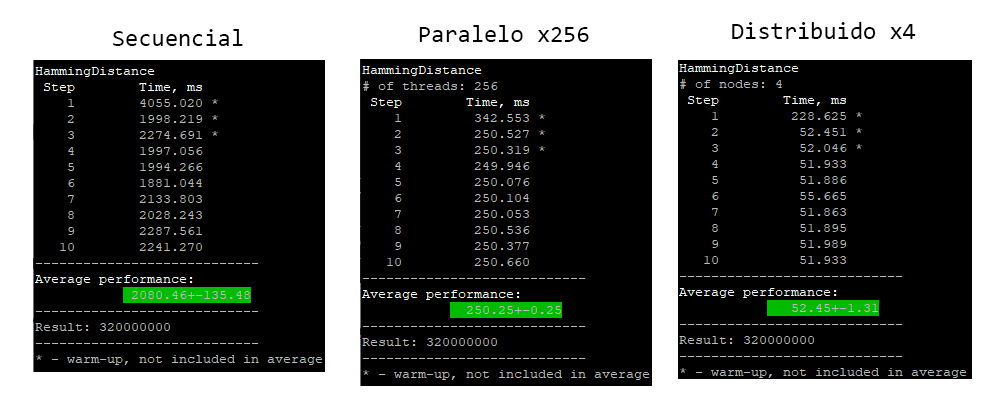

# Project-4-ST0263
## Compilación
Las 3 versiones se compilan con el siguiente comando:
```
make
```
## Ejecución:
Versión secuencial:
```
make run
```
Versión paralela y distribuida:
```
make queue
cat app.o____
```
##  Análisis de resultados 
Resultados de las 3 implementaciones con configuración por defecto en ms(milisegundos). En cada caso se ejecutó 10 veces y se obtuvo el tiempo promedio ejecución.

Resultados de las 3 implementaciones con configuración por defecto en ms(milisegundos)


### Versión paralela
En esta imagen se observan los resultados de la versión paralela, la cual se ejecutó con diferente número de hilos (32, 64, 128, 256). En cada caso se ejecutó 10 veces y se obtuvo el tiempo promedio ejecución.

En este caso tenemos 3 imágenes, la primera muestra el tiempo de ejecución con las diferentes configuraciones. En la segunda tenemos el speed up de cada configuración respecto a la versión serial. En la tercera tenemos la eficiencia para cada configuración.


### Versión distribuida
En esta imagen se observan los resultados de la versión distribuida, la cual se ejecutó con diferente número de nodos (2, 3, 4). En cada caso se ejecutó 10 veces y se obtuvo el tiempo promedio ejecución.

En este caso tenemos 3 imágenes, la primera muestra el tiempo de ejecución con las diferentes configuraciones. En la segunda tenemos el speed up de cada configuración respecto a la versión serial. En la tercera tenemos la eficiencia para cada configuración.

