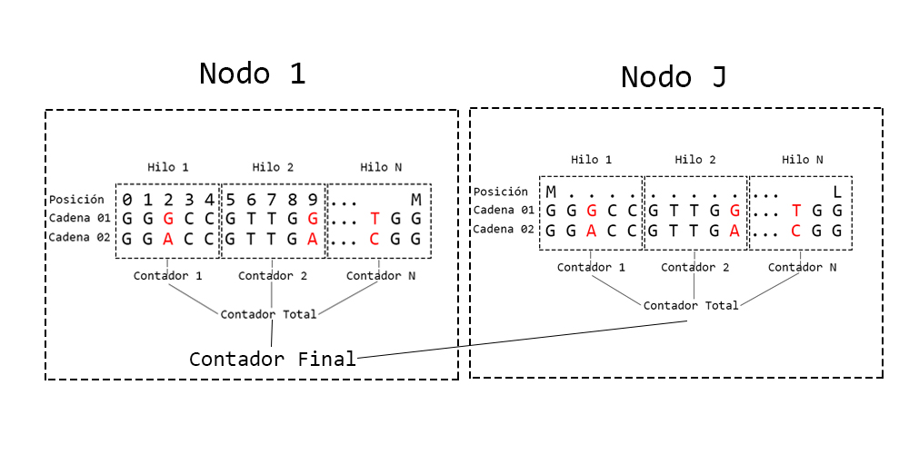

# Distancia de Hamming
En Teoría de la Información se denomina distancia de Hamming a la efectividad de los códigos de bloque y depende de la diferencia entre una palabra de código válida y otra. Cuanto mayor sea esta diferencia, menor es la posibilidad de que un código válido se transforme en otro código válido por una serie de errores.
-	La distancia Hamming entre 1011101 y 1001001 es 2.
-	La distancia Hamming entre 2143896 y 2233796 es 3.
-	La distancia Hamming entre "tener" y "reses" es 3.

La distancia de Hamming se denomina así gracias a su inventor Richard Hamming, profesor de la Universidad de Nebraska, que fue el que introdujo el término para establecer una métrica capaz de establecer un código para la detección y auto-corrección de códigos. Se emplea en la transmisión de información digitalizada para contar el número de desvíos en cadenas de igual longitud y estimar el error, por esto se denomina a veces como distancia de señal.
La distancia de Hamming como concepto en el reconocimiento molecular del ADN

La teoría de la codificación es una rama de las matemáticas que estudia los códigos y sus propiedades para diferentes aplicaciones. Un código es un conjunto de palabras. La longitud de una palabra de código L es el número de letras que crean la palabra de código, donde las letras a menudo se toman de un alfabeto. En nuestro caso, las secuencias de ADN se toman como palabras de código, donde L es el número de bases (A, C, G, T) que componen la secuencia. El número de posiciones en las que difieren dos palabras de código de la misma longitud es la distancia de Hamming. En el caso de las secuencias de ADN, definimos esta distancia como el número de bases por las cuales difieren. Suponemos que para cada secuencia de una longitud dada hay una distancia mínima de Hamming de tal manera que no haya hibridación cruzada siempre que la distancia de Hamming k sea mayor (o igual) que d . Si dos secuencias difieren en menos de d , pueden hibridarse de forma cruzada. 

### Datos entrada:
```
GGGCCGTTGGTGGGCCGTTGGT
GGACCGTTGACGGACCGTTGAC
```
### Datos salida:
```
6
```
## Algoritmo
```
int hammingDistance(string str1, string str2) 
{ 
    int count = 0; 
    for(int i = 0; i < str1.length(); i++)
    { 
        if (str1[i] != str2[i]) {
            count++; 
        }      
    } 
    return count; 
}
```
## Versión paralela


El programa recibe 2 archivos de entrada cada uno con una cadena, por lo cual se debe hacer un ciclo que va desde 0 hasta la longitud de las cadenas, por lo que podemos dividir estas cadenas según el numero hilos, ya que cada posición de una cadena solo depende de la misma poción en la otra cadena. Por ejemplo, si tenemos 2 cadenas, cada una con una longitud de 100 caracteres y tenemos 4 hilos, lo que hará el framework de OpenMP es crear 4 ciclos cada uno recorrerá 25 posiciones de las cadenas, además al aplicar la técnica de reducción, cada hilo crea su copia del contador y cuando todos terminan se suman en una variable final, esto con el objetivo de evitar problemas de concurrencia en la memoria lo cual también mejor la eficiencia del algoritmo.


## Versión distribuida


En este caso se incluye todo lo mencionado en la versión paralela, y se vuelve a aplicar el mismo método. Por ejemplo, si tenemos 2 cadenas, cada una con una longitud de 400 caracteres y tenemos 2 nodos de cómputo, cada uno se encargará de procesar 100 posiciones de las cadenas y por el método de reducción todos los nodos le mandan el contador resultado al nodo principal para que este los sume.

## PCAM
```
### Particionado:
Grueso

### Comunicación:
-	Todos los datos están en local.
-	La ejecución entre hilos y nodos es asincrónica, pero en determinados puntos se debe esperar hasta que el ultimo termine para continuar. 

### Aglomeración: 
Todos los nodos e hilos ejecutaran la misma función.

### Mapeo:
Se utilizara la técnica de reducir, para reducir la concurrencia en memoria y minimizar la comunicación entre nodos.
```
